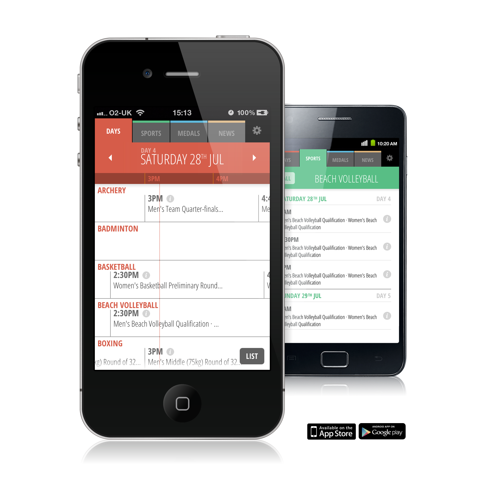

Go 2012
========

London 2012 Olympic App (iOS/Android) built in HTML5/JS using PhoneGap.  
[Visit Website](http://www.nicmulvaney.com/go2012app/)

#### About

This app was designed and built in 2012 and available for free on iOS (iPhone/iPad) and Android. The code is released as reference material for you to have a dig around. The world of Javascript is moving so fast, if I did this again I would do things very differently e.g...

 - Use [Grunt](http://www.gruntjs.com) to do the hard work
 - Use precompiled [Sass](http://sass-lang.com) instead of client compiled [Less](http://lesscss.org/) 
 - Use dynamic views like [AngularJS](http://angularjs.org/)
 - Use smarter Class based Javascript separation

#### Dependencies 

- [JQuery](http://jquery.com) (Vers 1.6.1)
- [Less](http://lesscss.org/) (Client-side usage)
- [iScroll 4](http://cubiq.org/iscroll-4)
- [Swipeview](http://cubiq.org/swipeview)
- [PhoneGap](http://phonegap.com/)
- [ChildBrowser](https://github.com/purplecabbage/phonegap-plugins/tree/master/iOS/ChildBrowser)
- [Open Sans Font](http://www.google.com/fonts/specimen/Open+Sans)

All included

#### Running this project

This is designed to run in PhoneGap but also can be ran in the browser (Chrome) give or take a few PhoneGap warnings. Nothing needs to be compiled. To preview at mobile sizes you can emulate the device [viewport](https://developers.google.com/chrome-developer-tools/docs/mobile-emulation#emulate-device-viewports) in the browser.

 This work is licensed under a <a rel="license" href="http://creativecommons.org/licenses/by-sa/3.0/deed.en_US">Creative Commons Attribution-ShareAlike 3.0 Unported License</a>.